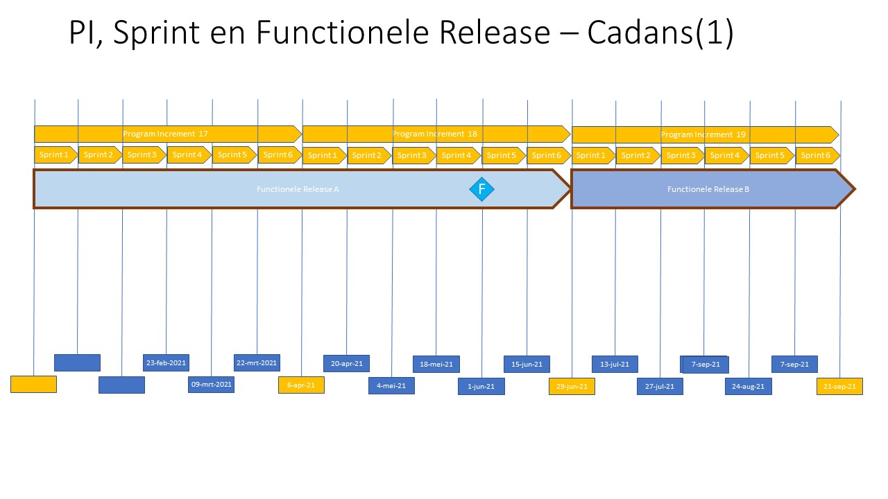
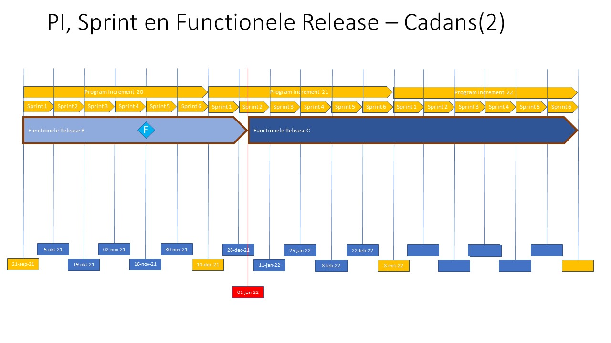

## Begrippen

### Cadans 

In de DSO keten wordt agile gewerkt. De kleinste eenheid zijn sprints, deze duren twee weken. Zes sprints vormen een Program Increment (PI). Deze opeenvolging van Sprints en PI's wordt Cadans genoemd. 

### Release 

Eigenlijk "Release on Demand". Hierbij bepaalt de business (lees de product- en releasemanagers) wanneer het moment daar is dat bepaalde functionaliteit (en dus eigenlijk welke versie van een product) in gebruik wordt genomen. 

### Roadmap 

Een Roadmap (letterlijk een wegenkaart) zet een aantal activiteiten in een bepaalde tijdsvolgorde. In een roadmap zitten "ijkpunten", vergelijk de plaatsen op de wegenkaart, en een moment waarop je in de tijd gezien daar bent. Binnen het DSO onderkennen we een functionele roadmap en een product roadmap.  
De roadmap volgt een Cadans van PI's (Program Incrememnts) en daarbinnen 6 Sprints (van twee weken) 

<figure id="PI_en_Sprint_Cadans_(1)">
    
    <figcaption>PI, Sprins en Cadans - Deel 1</figcaption>
</figure>

<figure id="PI_en_Sprint_Cadans_(2)">
    
    <figcaption>PI, Sprins en Cadans - Deel 2</figcaption>
</figure>

#### Functionele Roadmap

De functionele roadmap bestaat uit een beschrijving van welke **functies** wanneer beschikbaar komen. Deze functies worden gebundel in een **functionele release**. Deze releases hebben een letter *A*, *B*, enz. In een release is dus een set aan functies gebundeld en vrijgegeven voor productie.

<figure id="Functionele_Roadmap_(1)">
    
    <figcaption>Functionele Roadmap - Deel 1</figcaption>
</figure>

<figure id="Functionele_Roadmap_(2)">
    
    <figcaption>Functionele Roadmap - Deel 2</figcaption>
</figure>

De dikke blauwe pijlen geven een Roadmap aan. Binnen deze roadmmap wordt functionaliteit gebouwd en vrijgegeven voor gebruik. 

#### Product Roadmap

De product roadmap bestaat uit een beschrijving van welk product de gewenste functionaliteit realiseert. De producten hebben een versienummer volgens de semver methode met een versienummer dat is opgebouwd uit 3 getallen aangeduid met x.y.z. 

<figure id="Functionele_Roadmap_(1)">
    
    <figcaption>Functionele Roadmap - Deel 1</figcaption>
</figure>

<figure id="Functionele_Roadmap_(2)">
    
    <figcaption>Functionele Roadmap - Deel 2</figcaption>
</figure>

De product roadmap is opgedeeld in *Productlijnen* om het overzicht te bewaren. Deze 4 prodcutlijnen zijn STAM, STTR, STOP en TPOD's. 

###	Versie aanduiding

Een versie aanduiding is nodig om verschillende versies van release of van prodcuten van elkaar te kunnen onderscheiden. Zo heeft ook 

#### Functionele versie aanduiding

Een functionele versie aanduiding binnen de DSO keten wordt aangeduid met een letter "A", "B", enz. deze letters zijn aanduildingen voor een release, zodat aangegeven kan worden wanneer welke functies vanaf wanneer beschikbaar zijn binnen de keten. Omdat die functies worden gerealiseerd door de producten is per functionele release bekend welke producten daarbinnen vallen.

<a>Hier een voorbeeld:</a>

#### product versie aanduiding  

De semver methode onderkent 3 getallen in een versie, gescheiden door een ".". De individuele getallen staan voor MAJOR versie (x), MINOR versie (y) en PATCH versie (z). Elke(!) wijziging aan een product levert een nieuw versienummer op.
De afspraak binnen semver is dat een nieuwe "z" versie backwards compatible is. de "y" en de "x" versie hoeven dat niet te zijn. *Gevolg* hiervan is dat een "x" en een "y" versie meer inpacht *kunnen* hebben, maar dat hoeft niet. Een aanpassing waarbij nieuwe functionaliteit beschikbaar komt is een MAJOR of een MINOR release, maar doordat de nieuwe functionaliteit nog nooit eerder is gebruikt, is de impact op reeds bestaande software laag. Een "patch" versie lost een "bug" op, en heeft wel impact op de bestaande implementaties. Immers er *kunnen* workarounds zijn gemaakt om de bug te omzeilen, en deze moeten na uitkomen van de patch ongedaan worden gemaakt. 

<a>Hier een voorbeeld:</a>

#### concurrent versies

Concurrent versies zijn versies die (in de tijd gezien) naast elkaar bestaan. Een versie van een product dat "live" staat is een bepaalde tijd beschikbaar. Als er een bug is gerepareerd, of als er nieuwe of aangepast functionalitieit wordt gerealiseerd door een product komt er een nieuwe versie, met een nieuw versienummer van dat product. De nieuwe versie vervangt "op termijn" de oude versie. De termijn waarin een oude versie nog ge-support wordt is een kwestie van afspreken. 

Voor functionele releases is geen sprake van concurrent versioning. Immers de beschikbare functionaliteit wordt gerealiseerd door de prodcuten die onderdeel uitmaken van de fucntionele release. De functionele releases zijn "bundels" van functionaliteiten die worden gerealiseerd met de producten die onderdeel uitmaken van zo'n bundel.

###	Relaties

Een relatie is een verband dat er is tussen twee of meer verschillenden dingen

####  Tussen Functionele Roadmap en Product Roadmap 

Het is evident dat er een relatie is tussen de functionele roadmap en de product roadmap, immers een product zorgt ervoor dat een functie wordt gerealiseerd. De product roadmap zal dus ook "in de pas" moeten lopen met de functionele roadmap. 

####  Tussen Functionele Versie en Product Versie 

zoals al eerder aangegeven in dit document zal een versie van een product onderdeel uitmaken van een versie van een functionele release. Er is een overzicht nodig van welke versie van welk prodecut in welke versie van welke release zit.

<a>Hier een voorbeeld:</a>

### Deployment 

In de cadans worden steeds stukjes fucntionaliteit gerealiseerd in de prodcuten. Deze producten worden continu ge-deployed. De ge-deployde prodcuten zijn prodcutie gereed, dat wil zeggen getest, en geaccepteerd, en voor prodcutie klaargezet. De business bepaalt echter *wanneer*  die stukje functionaliteit in gebruik worden genomen, feitelijk in zo'n functionele release dus! 

